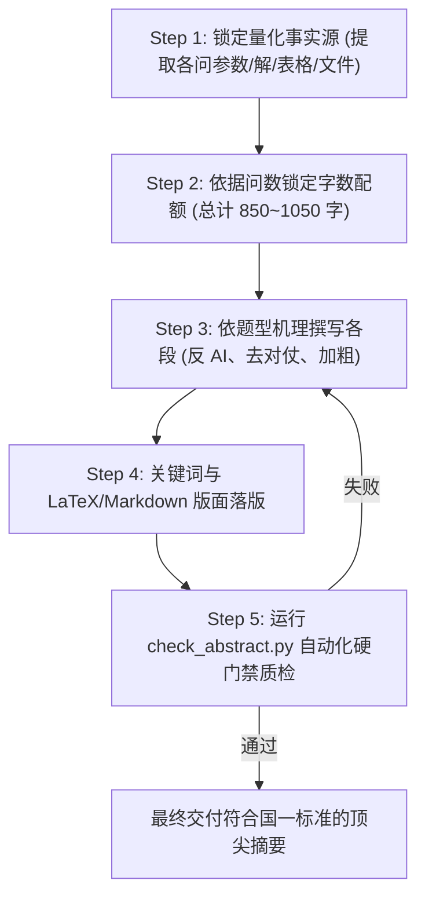

# 数学建模国赛《abstract（摘要）》技能指南

## 一、定位与适用场景

本技能提炼自全国大学生数学建模竞赛（国赛 CUMCM）历年一等奖高分真卷的深度多模态视觉研析，适用于：
- 数学建模竞赛论文第一页核心摘要的起草、润色、字数调优与排版质检；
- 杜绝大语言模型常见的空洞套话、对称排比对仗、缺少数据、公式外溢等 AI 缺陷；
- 适用于任何 Agent（DeepSeek、Claude、GPT、Gemini 等）开箱即用，支持 Markdown 与 LaTeX 双生态。

---

## 二、四大硬性铁律（必须无条件遵守）

### 铁律 1：严格单页铺满（850 ~ 1050 汉字）
- **绝不跨页**：摘要必须位于论文第 1 页，绝对禁止溢出至第 2 页（在 LaTeX 编译成品中，关键词末尾的 `\label{abstract:end}` 对应页码必须为 1）。
- **尽量铺满**：正文有效汉字数严格控制在 **850 ~ 1050 字区间**（推荐黄金值 **900 ~ 980 字**），在标准 A4 页面（1.2~1.3 倍行距）下版面覆盖率应达 **88% ~ 93%**，底边距页脚仅留 2.0~2.5cm，彻底避免下半页大面积留白给人以“工作量单薄”的负面初印象。

### 铁律 2：严禁独立公式，充实数学符号与单位
- **零独立公式**：绝对禁止使用展示型独立公式环境（严禁 `\begin{equation}`、`\begin{align}`、`\[...\]` 或 `$$...$$`）。
- **数学符号充实**：必须在行内广泛使用准确的数学变量、函数符号、物理量纲与高精度数值结果。
  - *允许且提倡*：$O(n\log n)$、坐标 $(0, -79)$、区间 $[14\text{s}, 15\text{s}]$、高精数据 $412.4738\text{ s}$、$38.295\text{ MW}$、$0.6096\text{ kW/m}^2$、$34\text{ 条}$、$99.96\%$。

### 铁律 3：**针对问题X：** 全加粗并突出核心重点
- **标签加粗**：各子问题核心段落开头必须使用 **`针对问题一：`**、**`针对问题二：`**、**`针对问题X：`**（Markdown 下写作 `**针对问题一：**`，LaTeX 下写作 `\paperstrong{针对问题一：}`），**冒号必须包含在加粗内**。
- **段内局部高亮**：每问段落内再精选加粗 **1~2 个核心模型/算法名称**及 **1~2 组决定性数值结果**（如 **自适应变步长搜索**、**$412.4738\text{ s}$**）。严禁连续多句或整段加粗。
- **关键词加粗**：末尾 `**关键词：**` 标签加粗，各关键词之间以空格或中文分号分隔。

### 铁律 4：彻底杜绝 AI 味，反对称工整套仗
- **禁用死板顺承词**：严禁滥用“首先、其次、然后、接着、最后”。
- **剔除排比对偶**：禁止每问统一机械复制“基于 A 建立了 B，求解了 C，取得了良好效果”的对称套路。
- **拒绝自吹自擂**：严禁“具有划时代的突破性价值”、“显著提升了泛化性与鲁棒性”、“成果斐然”等空洞修辞。
- **真实学术语态**：采用机理动词（*投影、联立、离散化、反解极角、二分逼近*）与具体客观数值驱动叙事。

---

## 三、五步闭环撰写工作流



### Step 1：锁定量化事实源
在动笔前，从建模代码与求解结果文件（如 `results/final_results.json`、`resultX.xlsx`）中锁定：
- 各问核心假设与模型名称；
- 核心求解算法或搜索策略；
- 最终收敛数值（带准确物理单位并保留规定小数位）；
- 最终生成的附录支撑表格或 Excel 文件名。

### Step 2：依据赛题问数锁定字数配额

| 题目问数 | 背景引言段 | 各子问题段配额 | 结尾/关键词配额 | 总汉字数预算 |
|---|---|---|---|---|
| **3 问赛题** | 90 ~ 120 字 | Q1: 240~270 字；Q2: 250~280 字；Q3: 250~280 字 | 关键词 30 字（无冗余评价） | **920 ~ 980 字** |
| **4 问赛题** | 80 ~ 110 字 | Q1: 190~220 字；Q2: 200~230 字；Q3: 200~230 字；Q4: 200~230 字 | 评价 30 字 + 关键词 30 字 | **940 ~ 1020 字** |
| **5 问赛题** | 70 ~ 90 字 | Q1~Q5 每段约 160 ~ 180 字 | 关键词 30 字（无冗余评价） | **930 ~ 1000 字** |

### Step 3：分段撰写与机理叙事
- **引言段**：直切物理、工程或经济现实矛盾，阐述建模核心目标，点出论文综合运用的方法论体系（不出现“针对问题”）。
- **分问段**：
  1. 阐明该问的核心力学/几何/经济机理与目标函数；
  2. 交代求解算法或决策变量搜索策略；
  3. 宣告核心收敛解与关键性能指标（给出具体数字，注明结果保存在 `resultX.xlsx` 或正文表 N）。

### Step 4：关键词与版面落版
- 选用 4~6 个精准反映核心理论与算法的专业术语作为关键词（如：`等距螺线；逐步逼近法；碰撞检测模型；动态搜索`）。
- 若为 LaTeX 排版，引入标准宏包并使用 `\paperstrong{针对问题X：}`，关键词后紧接 `\label{abstract:end}`，确保编译后页码为 1。

### Step 5：运行自动化质检门禁
执行离线校验脚本对摘要进行全项指标扫描：
```bash
python .dsh/skills/abstract/scripts/check_abstract.py --file <摘要文件路径>
```
若脚本报错，必须按提示在同一回合内修正字数、公式环境或加粗格式，直至退出码为 0。

---

## 四、深入参考资源

- 📖 **反 AI 语体与禁忌词库**：详见 [references/anti-ai-natural-style.md](references/anti-ai-natural-style.md)
- 📊 **6 篇国奖视觉蒸馏与四大题型范例**：详见 [references/cumcm-distilled-patterns.md](references/cumcm-distilled-patterns.md)
- 📝 **国赛标准 LaTeX 摘要模板片段**：详见 [references/latex-abstract-snippet.tex](references/latex-abstract-snippet.tex)
- 🛠️ **离线合规质检脚本**：详见 [scripts/check_abstract.py](scripts/check_abstract.py)
