# MetaMath Harness

基于 DeepSeek Harness `0.1.1-rc.2` 的数学建模增强套件。**无需预装任何 DeepSeek 相关软件**，安装脚本会自动装好官方本体、插件和全部依赖。

> 💬 QQ 交流群：**635765940**

## 最近更新（2026-09-04）

- **修复其他 AI IDE 全新安装后无法启动的问题**：此前安装包遗漏了“皮肤中心”和“免费联网搜索”两个插件的已构建产物，在全新电脑上装完首次启动会报“模块不存在”。现已补齐，重新下载 ZIP 覆盖安装（或重新一键安装）即可解决；已正常运行的现有安装无需任何操作。
- **修复安装脚本在旧版 Windows PowerShell 下的中文乱码报错**：Windows 自带的 PowerShell 5.1 会把含中文的安装/启动/便携版脚本按错误编码解析，直接报语法错误。已为全部含中文脚本补上标准 UTF-8 编码标记（BOM），重新安装后在旧终端下不再乱码。
- **修复安装过程中的警告中断**：安装脚本拉取依赖时，npm/pnpm 输出的警告信息在严格模式下会被误判为致命错误导致安装中途停止。已合并输出流处理，警告照常显示但不再中断安装流程。

## 最近更新（2026-09-02）

- **新增“图片转可编辑 PPT”模式**：把截图、扫描页、图片型 PDF/PPT 重建为对象级可编辑 `.pptx`，并保留结构校验与逐页失败关闭。
- **直接复用 DSH 当前生图连接**：专用模式只调用当前已配置的非 Codex 生图模型，不读取 Codex 图像认证、不消耗 Codex 图像额度，也不会在中途要求重复填写 API Key。
- **AI IDE 一键安装已包含 `editppt`**：根目录安装脚本会在项目内自动准备隔离 Python 与 CLI；用户无需预装 Python、uv、pipx、editppt，也无需配置 PATH。首次安装需要联网下载运行依赖，之后相同版本会自动跳过。

<p align="center">
  
  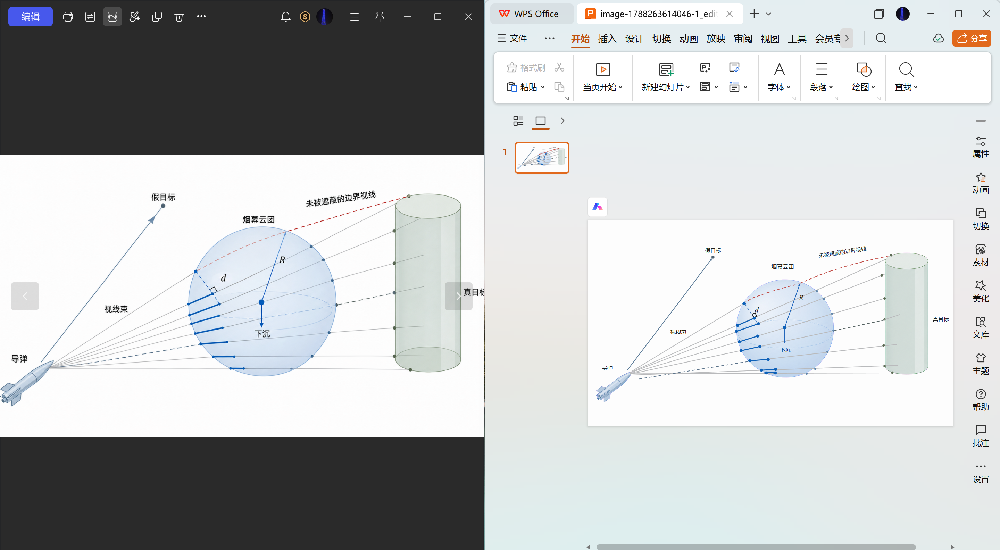
</p>

<p align="center">
  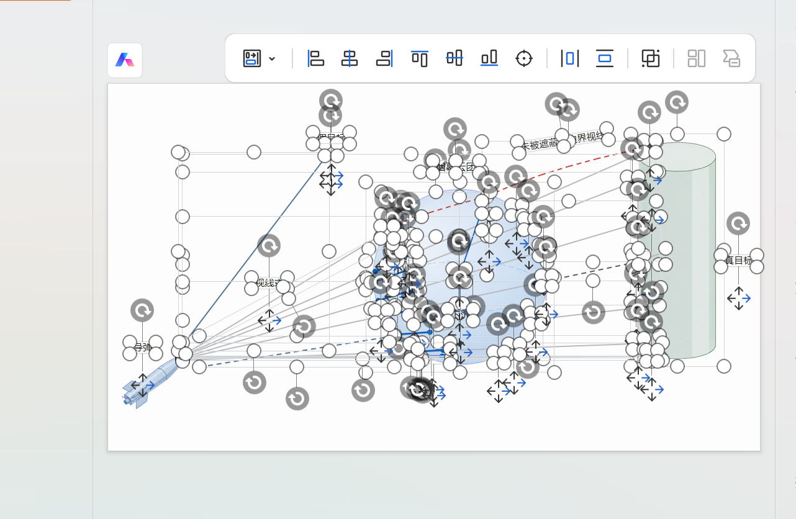
  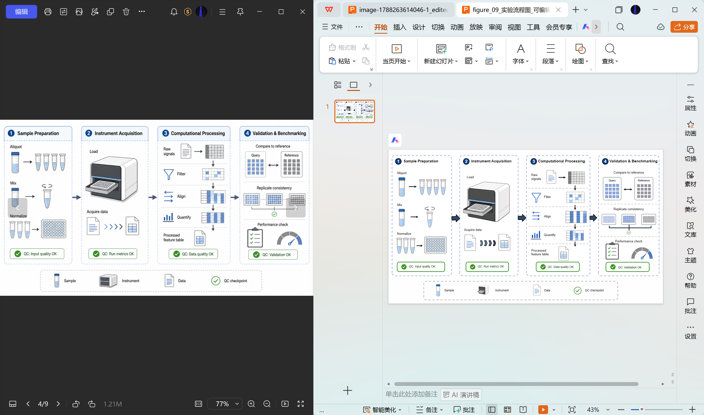
</p>

<p align="center">
  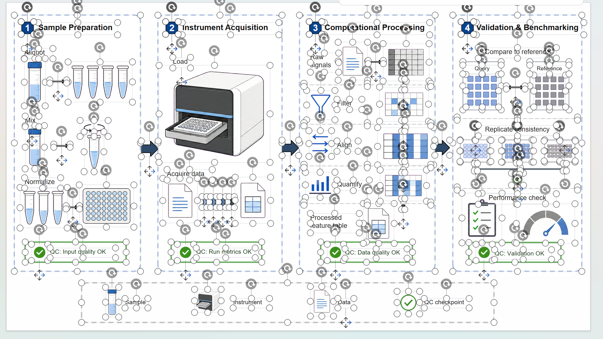
</p>

## 最近更新（2026-09-01）

- **API Key 号池与原生 Web 共存**：开发版新增独立的 `pool-*` Provider，并在设置页提供与原生模型配置一致的号池卡片；可逐枚添加多个 Key、逐行维护模型目录和识图能力，普通 Provider 不会被号池观察或改写。
- **真实附件与并发一致性**：号池模型已接入 Harness 持久附件服务；同值 Key 并发去重、不同 Key 并发挂池、失败回滚和流式请求固定 Key 均经过自动测试。Key 只由 DSH Credentials 管理，页面、日志和接口不会回显完整值，失败切换有界且不会无限重试。
- **来源与使用方式**：基于 [xiaozhe7772222/dsh-api-key-pool](https://github.com/xiaozhe7772222/dsh-api-key-pool) `v0.3.0` 适配，作者 `xiaozhe7772222`，MIT 许可证。正常安装后在原生 3080 的设置页使用；需要完全隔离时运行 `启动-DeepSeek-Harness-号池.ps1` 打开 3081 专用 Profile。

## 最近更新（2026-08-30，跨会话知识库）

- **SQLite 跨会话知识库**：开发版接入本地 SQLite FTS5 知识检索，可在不同会话间搜索、列出和维护已保存知识；写入、更新和删除都要求用户确认，默认关闭会产生额外模型调用的查询扩展，数据保存在本机 DSH 数据目录中，不进入源码仓库。
- **来源与使用方式**：基于 [NinjaSln-labs/dsh-plugins](https://github.com/NinjaSln-labs/dsh-plugins/tree/main/dsh-knowledge-sqlite) 的 `dsh-knowledge-sqlite v0.1.6` 适配，作者/组织 `NinjaSln-labs`；上游源码与 npm 元数据均声明 MIT。正常安装后由 Agent 使用 `knowledge_*` 工具，任何写入、更新或删除都会先请求确认。

## 最近更新（2026-08-30，新增界面展示）

- **右侧工作台**：聊天时可以在右侧打开文件、PDF、终端和浏览器，底部终端也能继续保留。查资料、看论文或运行命令时，不必反复切换窗口。
- **多代理与侧边对话**：同一页面可以并排使用多个侧边对话，也能把 Codex CLI、Claude Code、OpenCode 等终端放进工作台。各面板独立运行，不会替用户自动发送消息。
- **侧边卡片设置**：进入“设置 → 侧边卡片”，可以按需开关文件、终端、浏览器、源码管理和预览功能。关闭的卡片不会出现在工作台入口中。
- **免费搜索设置**：进入“设置 → 插件 → Free Search”即可选择搜索引擎。Bing、DuckDuckGo 等免费引擎无需 API Key；需要密钥的服务可以统一交给凭据中心管理。

<p align="center">
  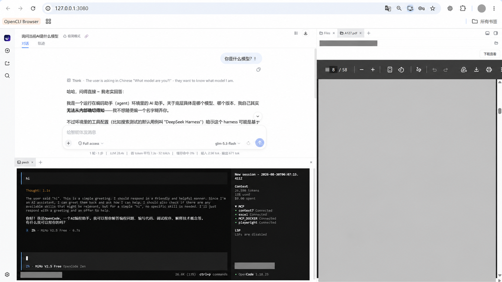
  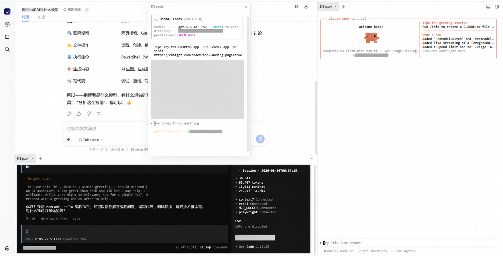
</p>

<p align="center">
  
  
</p>

<p align="center">
  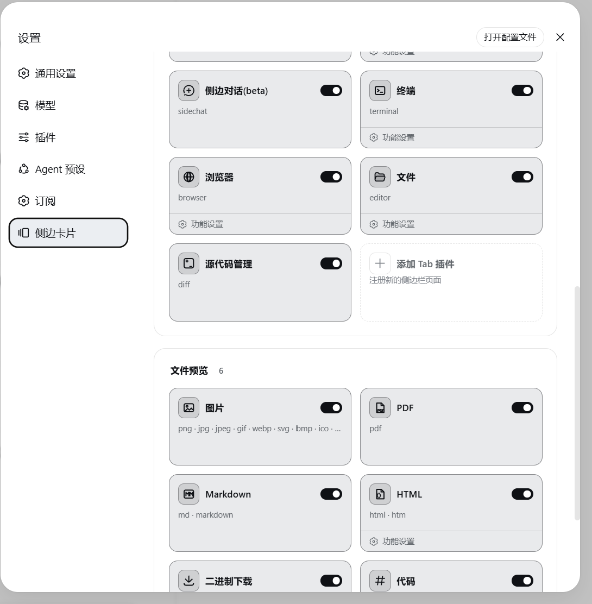
  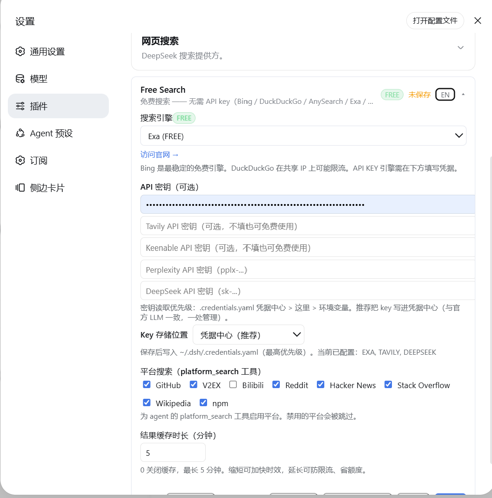
</p>

## 最近更新（2026-08-30）

- **新增右侧工作台与免费搜索插件**：接入 `dsh-better-sidebar` 0.17.1（文件树、编辑器、浏览器、终端、Git 面板与后台任务）和 `dsh-free-search` 0.4.14；均按插件范式自激活，可单独停用或卸载，不修改官方包。
- **统一订阅会话与生图连接**：Codex、Claude、Grok 登录和刷新由 `dsh-plugin-subscriptions` 0.5.2 统一管理；ChatGPT 与 Grok 订阅生图只读取短生命周期会话快照，不接触 refresh token，401 最多刷新重试一次。
- **补充工程维护门禁**：新增独立维护范式，固化官方升级、自定义图标保护、第三方来源追溯、版本门、脱敏发布和最小回滚要求。
- **品牌图标统一为桌面快捷方式图标**：展开侧栏、收起侧栏和浏览器标签统一使用 `MetaMath-Harness.ico`，并保持“大道至简”与其余界面不变。
- **技术路线图新四类模板改为原创原型原样直录**：`kind=roadmap` 命中的四个模板（双面板双层 / 阶段块 / 侧标步骤 / 堆叠横幅）不再重绘，改为用户授权原创原型逐项直录——布局、配色、渐变按钮、悬浮边与航点全保真，文字由 AI 按 labels 键替换为项目语境（中文自动雅黑）；配套校验同步支持嵌套布局与悬浮边，并新增 `math-paper-cn-drawio` 绘图技能随包分发。
- **优秀论文库统一并随程序分发**：国赛、华为杯、美赛和亚太杯等 35 份优秀论文集中在 `.dsh/往年优秀论文/`，源码与便携版都会携带；论文和评审卡片开启优秀论文校准后按赛事、题号最多选两篇，找不到匹配样本会继续按官方规则运行。
- **全自动论文流程提速：Goal 全程静默 + 门禁失败单回合闭环**：三张论文卡片开启"全自动持续到最终 PDF"后，Goal 存续期间每回合只回"…"不再写中期报告；阶段门禁失败时自动生成 `failures_summary.json` 失败清单，要求一次性读全并单回合修完再重跑，杜绝逐项拉锯。
- **新增 Grok 订阅生图连接**（第六类生图连接 `grok-subscription`）：走 xAI 官方 Images API（`grok-imagine-image` 系列模型），复用 Grok 订阅登录，无需 API Key；订阅页完成 Grok 登录后，生图模型区新建"Grok 订阅"连接即可用。
- **修复数学建模全自动流程概率不触发 Goal 的问题**：三张论文卡片（math-paper-cn / huashu / huawei）开启"全自动持续到最终 PDF"时，会在执行要求首条注入 Goal 激活指令。
- **Grok 订阅模型上下文窗口改为 xAI 官方实测值**：7 个模型逐一取自 `api.x.ai/v1/models` 官方返回（1M / 500k / 256k），不再回退默认 256k。
- **恢复 README 展示**：找回历史版本中的两种下载方式说明与 14 张界面预览图。

## 最近更新（2026-08-26）

- **品牌图标统一为桌面快捷方式图标**：展开侧栏、收起侧栏和浏览器标签统一使用 `MetaMath-Harness.ico`，并保持“大道至简”与其余界面不变。
- **技术路线图新四类模板改为原创原型原样直录**：`kind=roadmap` 命中的四个模板（双面板双层 / 阶段块 / 侧标步骤 / 堆叠横幅）不再重绘，改为用户授权原创原型逐项直录——布局、配色、渐变按钮、悬浮边与航点全保真，文字由 AI 按 labels 键替换为项目语境（中文自动雅黑）；配套校验同步支持嵌套布局与悬浮边，并新增 `math-paper-cn-drawio` 绘图技能随包分发。
- **优秀论文库统一并随程序分发**：国赛、华为杯、美赛和亚太杯等 35 份优秀论文集中在 `.dsh/往年优秀论文/`，源码与便携版都会携带；论文和评审卡片开启优秀论文校准后按赛事、题号最多选两篇，找不到匹配样本会继续按官方规则运行。
- **全自动论文流程提速：Goal 全程静默 + 门禁失败单回合闭环**：三张论文卡片开启"全自动持续到最终 PDF"后，Goal 存续期间每回合只回"…"不再写中期报告；阶段门禁失败时自动生成 `failures_summary.json` 失败清单，要求一次性读全并单回合修完再重跑，杜绝逐项拉锯。
- **新增 Grok 订阅生图连接**（第六类生图连接 `grok-subscription`）：走 xAI 官方 Images API（`grok-imagine-image` 系列模型），复用 Grok 订阅登录，无需 API Key；订阅页完成 Grok 登录后，生图模型区新建"Grok 订阅"连接即可用。
- **修复数学建模全自动流程概率不触发 Goal 的问题**：三张论文卡片（math-paper-cn / huashu / huawei）开启"全自动持续到最终 PDF"时，会在执行要求首条注入 Goal 激活指令。
- **Grok 订阅模型上下文窗口改为 xAI 官方实测值**：7 个模型逐一取自 `api.x.ai/v1/models` 官方返回（1M / 500k / 256k），不再回退默认 256k。
- **恢复 README 展示**：找回历史版本中的两种下载方式说明与 14 张界面预览图。

## 界面预览

<p align="center">
  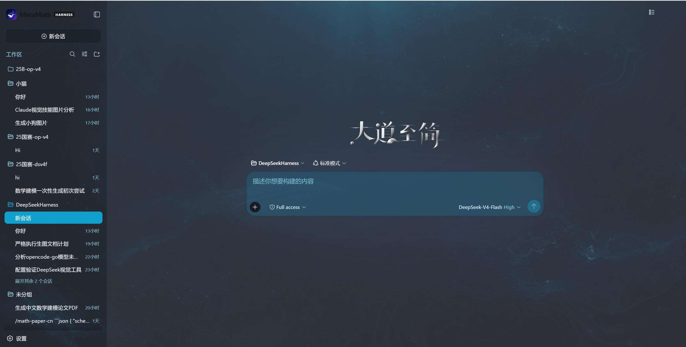
  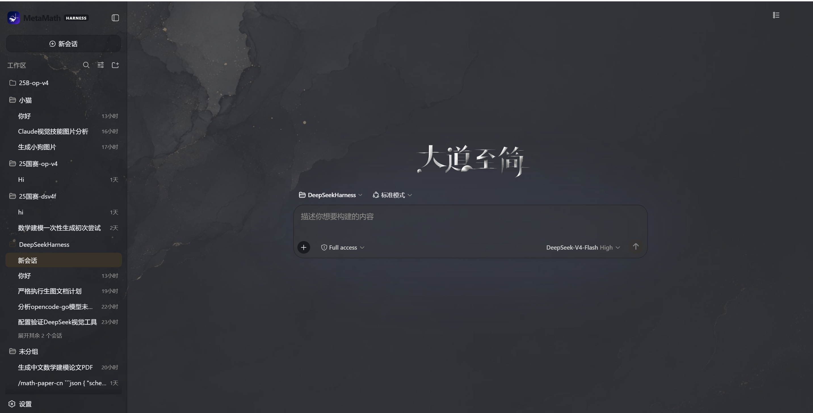
</p>

<p align="center">
  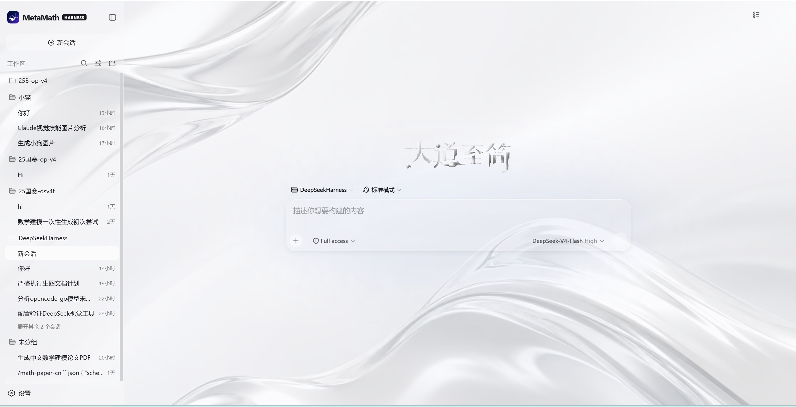
  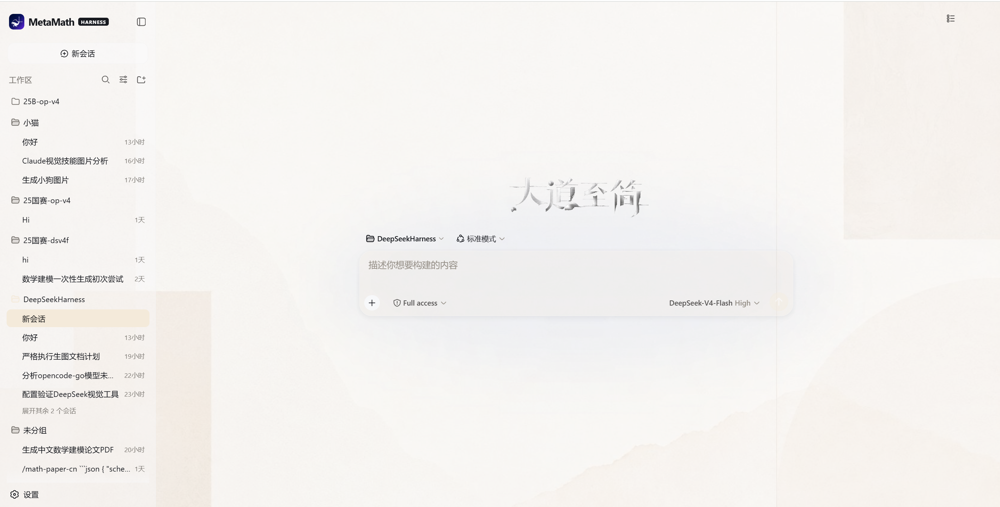
</p>

<p align="center">
  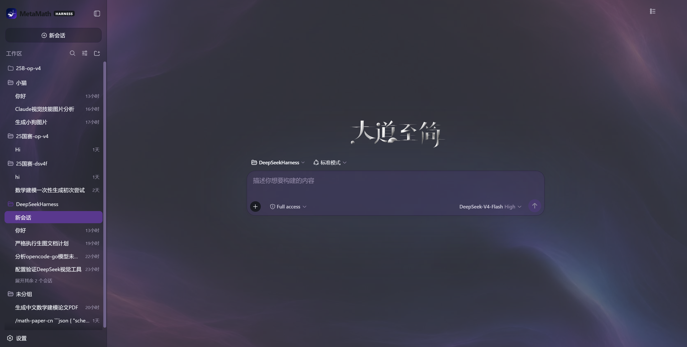
  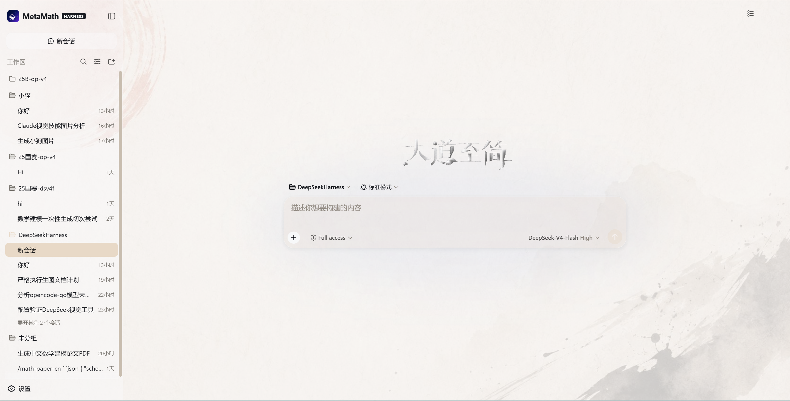
</p>

<p align="center">
  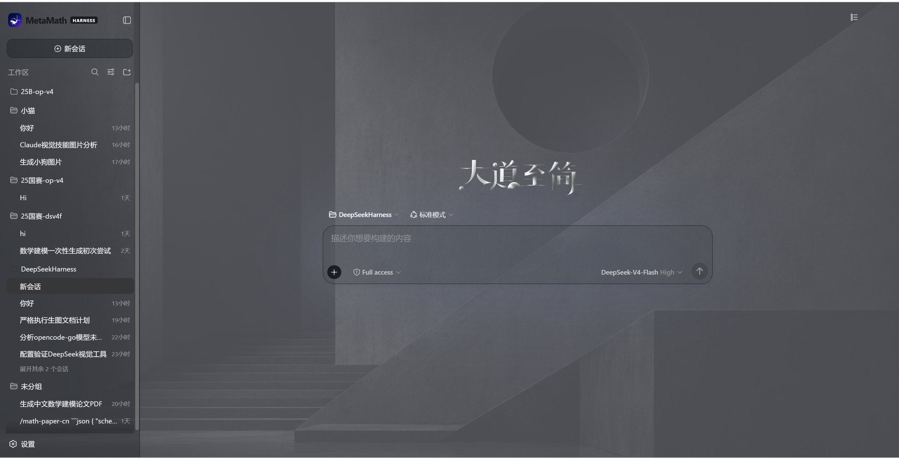
  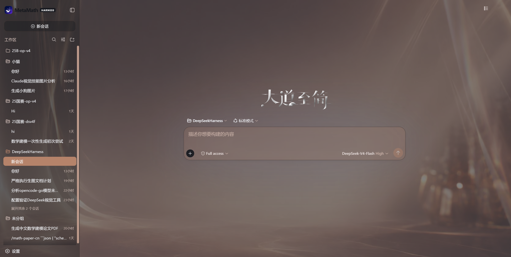
</p>

<p align="center">
  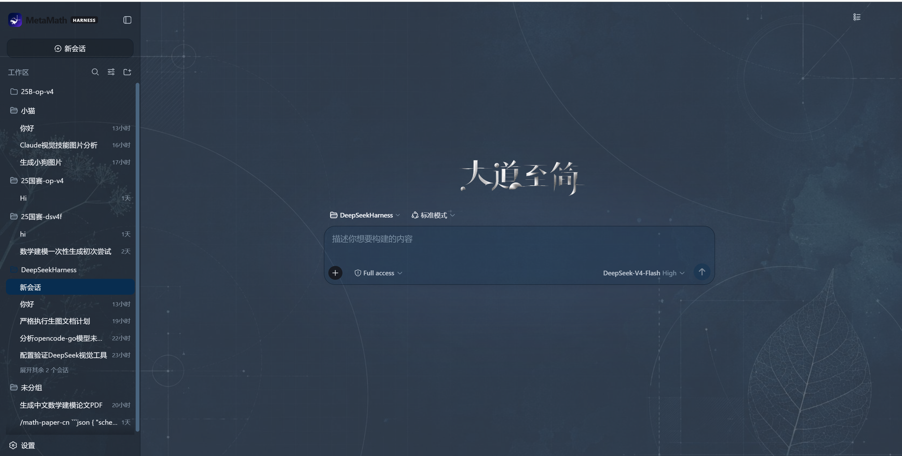
  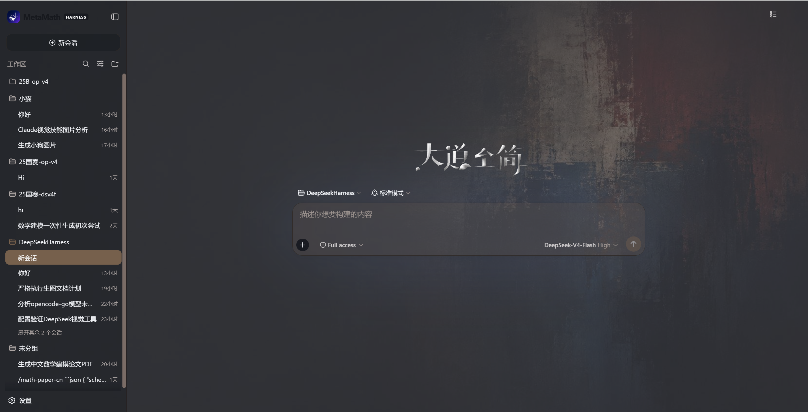
</p>

<p align="center">
  
  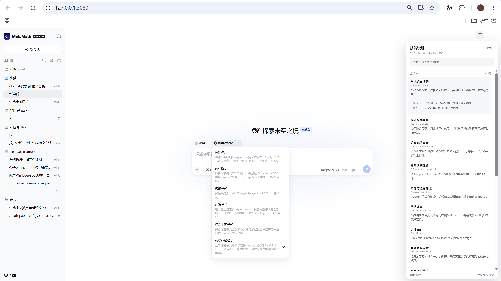
</p>

<p align="center">
  
  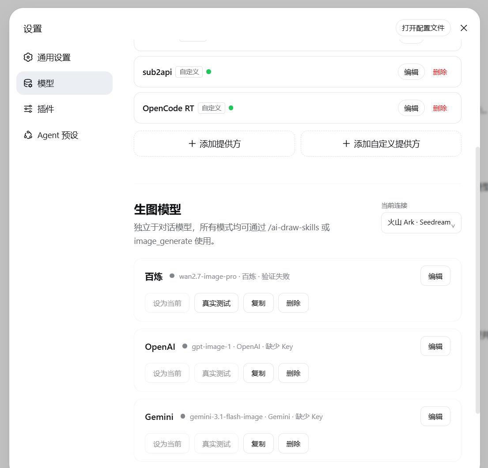
</p>

## 📦 两种获取方式（任选其一）

### 方式一：AI IDE 一键安装（会用 AI IDE 的用户）

把本仓库链接 `https://github.com/LKQ667/metamath-harness` 发给 AI IDE（Trae、Cursor 等），再说一句"帮我安装这个项目"。AI 会按根目录 [`AGENTS.md`](AGENTS.md) 的指引自动完成安装、准备图片转可编辑 PPT 组件、创建桌面快捷方式并启动，全程无需手动操作。

### 方式二：ZIP 直接下载（普通用户，可装到任意盘符）

到 [Releases 页面](https://github.com/LKQ667/metamath-harness/releases/latest) 下载最新的 `metamath-harness-v*.zip`（已清理测试文件，更小更干净），解压到任意位置（如 `D:\`），进入文件夹**双击 `install.cmd`** 即可。

> 前提同样是 Node.js >= 22（下载安装：https://nodejs.org ，装完重开终端）。

---

## 🚀 手动安装（三步，普通 Windows 10/11 电脑）

**第 1 步：装 Node.js**（已装可跳过；装完要重开终端）

```powershell
winget install OpenJS.NodeJS.LTS
```

**第 2 步：下载本项目并进入目录**

```powershell
git clone https://github.com/LKQ667/metamath-harness.git
cd metamath-harness
```

> 没有 Git？装一个：`winget install Git.Git`；或者用第 2 步替代版（无需 Git）：
> ```powershell
> Invoke-WebRequest 'https://github.com/LKQ667/metamath-harness/archive/refs/heads/main.zip' -OutFile mmh.zip -UseBasicParsing
> Expand-Archive .\mmh.zip -DestinationPath .
> cd metamath-harness-main
> ```

**第 3 步：一键安装并启动**

在文件夹里**双击 `install.cmd`**（任何机器都能用），或在 PowerShell 里运行：

```powershell
.\install.ps1
```

> 若报红字“因为在此系统上禁止运行脚本”，说明系统脚本策略为 Restricted，改用这条（同样任何机器可用）：
> ```powershell
> powershell -ExecutionPolicy Bypass -File .\install.ps1
> ```

看到浏览器自动打开 `http://127.0.0.1:3080` 就成功了，桌面会同时出现 **「MetaMath Harness」快捷方式**。首次使用请在网页设置里填自己的模型供应商和 API Key（Key 只存本机）。

### 服务器 / 没有 winget 和 Git 的机器

Node 改用官网安装包：到 https://nodejs.org 下载 LTS（≥22）MSI 安装，然后直接用上面的"第 2 步替代版"下载本项目，再双击 `install.cmd`（或跑 `.\install.ps1`）。

### 安装到指定盘符（如 D 盘）

默认装在你**打开终端时所在的目录**。想装到 D 盘（或 E、F 等任意盘），第 2 步前先切过去即可（以下命令已在 Windows 10 + Node 24 真机验证通过）：

```powershell
cd D:\
git clone https://github.com/LKQ667/metamath-harness.git
cd metamath-harness
.\install.ps1
```

ZIP 方式同理：

```powershell
cd D:\
Invoke-WebRequest 'https://github.com/LKQ667/metamath-harness/archive/refs/heads/main.zip' -OutFile mmh.zip -UseBasicParsing
Expand-Archive .\mmh.zip -DestinationPath .
cd metamath-harness-main
.\install.ps1
```

装到哪个盘，快捷方式就指向哪个盘（实测桌面快捷方式工作目录为 `D:\metamath-harness`），全部文件都在该文件夹内，不会在 C 盘留东西。PowerShell 若报“禁止运行脚本”，把最后一行换成 `.\install.cmd` 即可。

### 日常启动（装过一次之后）

**双击桌面的「MetaMath Harness」快捷方式**即可（无需打开终端）。

也可以用命令（PowerShell 或 cmd 均可）：

```powershell
cd metamath-harness    # 进入项目目录
.\install.cmd -StartOnly
```

其他参数：`-NoStart` 只装不启动｜`-Port 3081` 换端口

---

## 安装脚本做了什么

检查 Node → 确保 pnpm → 从官方 npm 安装 DeepSeek Harness 本体 → 构建 Mathmodel 插件 → 安装 Web 依赖 → 创建桌面快捷方式 → 启动并打开浏览器。全程无需人工干预；所有内容都装在项目文件夹内，删文件夹即完整卸载（桌面快捷方式可一并删除）。

## 目录结构

```text
install.ps1              一键安装并启动脚本
install.cmd              双击入口（资源管理器/cmd 可用，自动绕过脚本策略限制）
plugins/dsh-mathmodel/   外置 Mathmodel 插件（源码、测试、脚本、文档）
.dsh/.agent-presets/     Agent Preset：mathmodel（数学建模）、imagegen（标准生图）
.dsh/profiles/web/       Web Profile 接线（package.json、pnpm-lock、cordis.patch.yml）
.dsh/skills/             18 个手动 Skill，其中 12 个带 mathmodel-card.yml 参数卡片
.dsh/往年优秀论文/       随程序分发的统一论文库、目录清单与 35 份 PDF
portable/                Windows 便携版构建、启动、自检脚本
构建便携版.ps1            构建便携运行包入口
启动-DeepSeek-Harness.cmd 便携版启动入口
依赖自检.cmd              依赖预检入口
```

## 内置优秀论文库

程序把可用样本统一放在 `.dsh/往年优秀论文/`，并通过 `catalog.json` 记录赛事、年份、题号和 SHA-256。`math-paper-cn`、`math-paper-huashu`、`math-paper-huawei` 与 `grill-ai-review` 保留原来的 boolean 开关：开启后只选择同赛事、同题号的样本，默认最多两篇；目录为空、题号不匹配或文件校验失败时会说明原因并继续，不会卡住论文或评审流程。

新增或替换 PDF 后，运行 `python .dsh/skills/_shared/scripts/discover_excellent_papers.py --dsh-home .dsh --verify-all` 核验目录清单。内置 PDF 会使源码和发行包增加约 162 MiB。

## 可选依赖

Python 3、TeX Live（XeLaTeX）、Draw.io、Poppler——用于论文与绘图链路，缺了也不影响安装启动，插件预检会提示按需安装。

插件详细用法、升级与回滚见 [`plugins/dsh-mathmodel/README.md`](plugins/dsh-mathmodel/README.md)。

## 订阅登录（ChatGPT / Claude / Grok）

内置两个第三方 OAuth 插件，在 Web 设置 → 订阅页登录订阅账号即可作为 provider，无需 API Key；令牌只保存在本机（0600 权限，自动刷新），不进入仓库或归档：

- [dsh-plugin-subscriptions](https://github.com/V1ki/dsh-plugin-subscriptions)（npm `0.3.1`，MIT）：默认启用 Claude 与 Grok 聊天路由；
- [dsh-llm-oauth](https://github.com/ziyou979/dsh-llm-oauth)：提供 OpenAI Codex（ChatGPT）登录，目录限定 `openai-codex`；配合 `dsh-mathmodel` 新增的"ChatGPT 订阅"生图连接（`codex-subscription` 模板 + `codex-images` 适配器），token 自动预刷新、统一连接管理 UI、无外部网关。该连接走 ChatGPT 订阅 Codex 生图端点（非官方支持端点，存在账号限制风险）。

Grok 订阅登录除聊天路由外，还可直接用于生图：生图模型区新建"Grok 订阅"连接（`grok-subscription` 模板，走 xAI 官方 Images API，模型 `grok-imagine-image` 系列），无需 API Key。

## 便携版（免安装包）

`构建便携版.ps1` 可构建自带 Node/Python/TeX Live 的完整便携包（解压双击即用，构建需约 20 GB 临时空间），详见 [`portable/README.md`](portable/README.md)。

## 凭据与安全

- API Key 通过插件"受管凭据"保存，支持 `DASHSCOPE_API_KEY`、`OPENAI_API_KEY`、`GEMINI_API_KEY`、`CUSTOM_IMAGE_API_KEY` 四类引用；Key 不写入仓库文件、日志或 Prompt；
- 严禁提交 `.env`、`.credentials.yaml`、`storages/`、`sessions/`、`logs/` 等用户状态（已在 `.gitignore` 中排除）；
- 所有 Skill 卡片确认后仅写入可编辑草稿，绝不自动发送；付费生图需凭据、健康检查、数量上限与用户单次授权同时满足。

## 测试

```powershell
cd plugins/dsh-mathmodel
npm test        # 构建并运行全部单元测试
npm run check   # 全部源码语法检查
```

## 支持作者（完全自愿）

这个项目免费开源，没有广告，也没有任何付费功能。如果你用下来确实省了时间，想请作者喝杯咖啡，可以扫下面任意一个码；不扫也完全没关系，所有功能对所有人都一样。

<p align="center">
  
  
</p>
<p align="center">微信（左）｜支付宝（右）</p>

## 许可

`plugins/dsh-mathmodel` 为 MIT；其余配置与脚本基于 DeepSeek Harness 插件范式编写，仅供学习与研究使用。
